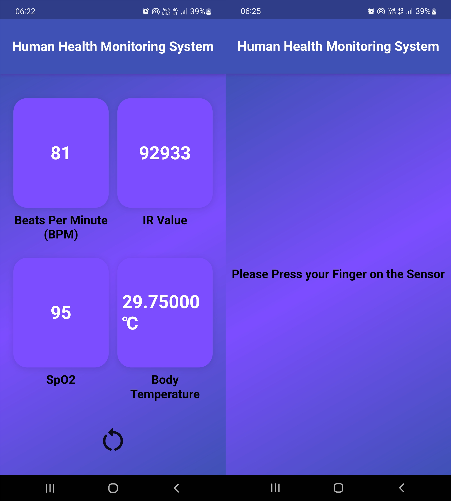

# human_health_monitoring_system

A new Flutter project for monitoring human health.This project has two parts a hardware device which is made using NodeMCU controller , MAX30102 pulse and SP2 sensor, DS18B20(Digital temperature sensor), and humidity sensor. The code for nodeMCU and the for algorithm and flowchart can be found <a href="https://github.com/SanketSarmalkar/HumanHealthMonitoringSystem">here</a>. Android app is made using ThingSpeak and local storage using Hive.

## Introduction

The modern visionary of healthcare industry is to provide better healthcare to people in a more economic and patient friendly manner. Therefore, for increasing the patient care efficiency, there arises a need to improve the patient monitoring devices. The medical world today faces the most major problem that is the need of health care providers presence near the bedside of the patient. In this busy lifestyle, monitoring our health condition is becoming hectic so everyone expects to know about their health conditions using some smart technology

which can be easily accessible and is effective. As the computers, bio instrumentation, and telecommunications
technologies are being advanced, it has become feasible to design more the smart devices which help in tele monitoring systems to record data, acquire data, and display the data and to transmit the health signals from the human body to any location. Telemedicine benefits both the patients with efficient health care facility and even the doctors who can give better assistance to the people.

It is cost effective. It can increase the efficiency through better management of patient monitoring, shared health professional staffing. Tele monitoring involves remotely monitoring the patient health care. These devices keep track of blood pressure, heart rate, weight, blood glucose etc. of the patient. The Telemedicine system consists of customized hardware and software at both the patient and specialist doctor ends.

This project discusses the advantages of using android technology and Arduino for patient health monitoring system. In this technology the data is collected from a patient, to feed the same to separate interfaces in which the patient parameters and details is displayed on the local server.
The person then can connect to the local IP and can get, analyse and can take preventive measures before he reaches the hospital in serious case.

Hence, this project can be used to help the patients monitoring and assistance by using the trending technology.

## Screenshots

## Getting Started

This project is a starting point for a Flutter application.

A few resources to get you started if this is your first Flutter project:

- [Lab: Write your first Flutter app](https://docs.flutter.dev/get-started/codelab)
- [Cookbook: Useful Flutter samples](https://docs.flutter.dev/cookbook)

For help getting started with Flutter development, view the
[online documentation](https://docs.flutter.dev/), which offers tutorials,
samples, guidance on mobile development, and a full API reference.